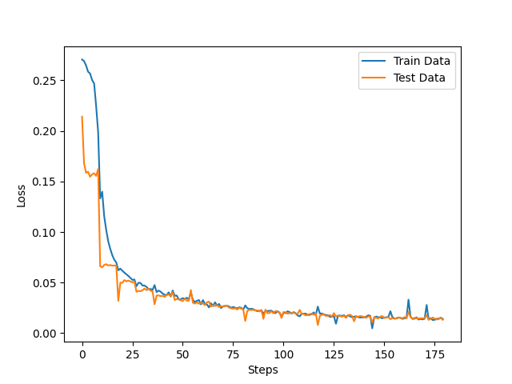

# Feature Embedding
A sample project to convert feature vectors into embeddings using MovieLens dataset.

## Setup
```shell
# Download MovieLens dataset
mkdir data
curl https://files.grouplens.org/datasets/movielens/ml-latest-small.zip > data/ml-latest-small.zip
unzip -d data data/ml-latest-small.zip
```

## Installation
```shell
pip install .[example]
```

## Run
```shell
python examples/train.py
```

## Result


## Uninstallation
```shell
pip uninstall embedding
```
